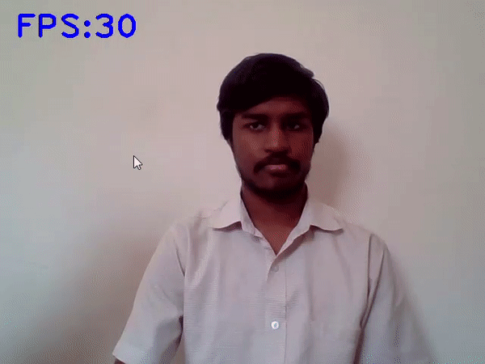
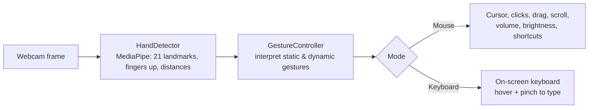

# ✋ Real-Time Human-Computer Interaction Using Hand Gestures

Control your computer with your bare hands. This project turns a standard webcam into a **virtual mouse and keyboard** using OpenCV and MediaPipe, letting you move the cursor, click, drag, scroll, type, adjust volume and brightness, take screenshots, and launch apps entirely through hand gestures. It was built with accessibility in mind, as an alternative input method for people who cannot use a traditional mouse and keyboard.

📄 **Published at an international Springer conference.** See [Publication](#publication).




> Faces in the demo recordings are blurred for privacy. The overlays (hand skeleton, bounding box, gesture label, FPS) are the live output of the application.

## Overview

Traditional human-computer interaction relies on a physical mouse and keyboard. This project explores a natural, touch-free alternative: the webcam captures your hand, MediaPipe extracts 21 hand landmarks in real time, and a gesture controller maps the shape and motion of your hand to concrete actions on the computer. Both **static gestures** (a specific finger pose) and **dynamic gestures** (motion over time, used for scrolling and volume or brightness control) are supported, and the whole loop runs live at interactive frame rates.

## Features

The system runs in two modes. Show **two open palms** to toggle between them.

**Mouse mode**

| Gesture | Action |
| --- | --- |
| Open palm (5 fingers) | Neutral / rest |
| Index finger only | Move the cursor |
| Index + middle (V) | Arm for clicks |
| Pinch from V | Left / right click, double click |
| Fist after V | Drag |
| Fist after Neutral | Screenshot |
| Index + middle + ring, moved | Scroll (right hand), volume or brightness (left hand) |
| Thumb only | New tab / close tab |
| Index + pinky | Open browser |
| Thumb + pinky | Open messaging app / calculator |

**Keyboard mode**

An on-screen keyboard is drawn over the video feed. Hover your index finger over a key and pinch your index and middle fingers together to press it, with support for Caps Lock, Space, Enter, and Backspace.

## How It Works



1. **Hand detection** (`hand_tracking_module.py`): a `HandDetector` class wraps MediaPipe Hands to find hands in each frame and return landmark coordinates, which fingers are up, and distances between landmarks.
2. **Gesture control** (`main.py`): the `GestureController` reads the finger pattern and motion, decides which gesture is being made, and triggers the matching action through `pyautogui`, `autopy`, `pynput`, `screen_brightness_control`, and `AppOpener`. A short action delay prevents a single gesture from firing repeatedly.
3. **Virtual keyboard** (`virtual_keyboard.py`): the button model, key layout, and rendering for the on-screen keyboard.

## Tech Stack

- **Language**: Python
- **Computer Vision**: OpenCV, MediaPipe, cvzone
- **Numerical**: NumPy
- **System control**: PyAutoGUI, autopy, pynput, screen_brightness_control, AppOpener

> Note: the system control libraries and the DirectShow capture backend target **Windows**.

## Repository Structure

```
A-Real-Time-Human-Computer-Interaction-using-Hand-Gestures-in-OpenCV/
├── src/
│   ├── hand_tracking_module.py   # HandDetector: MediaPipe hand tracking wrapper
│   ├── virtual_keyboard.py       # Button model, key layout, and keyboard rendering
│   └── main.py                   # GestureController and the real-time loop
├── docs/
│   ├── Project Report.pdf        # full project report
│   └── Project PPT.pptx          # project presentation
├── assets/                       # demo recordings
└── README.md
```

## Running the Project

Requires Python and a webcam (Windows recommended for full functionality).

```bash
pip install opencv-python mediapipe numpy cvzone pyautogui autopy pynput screen-brightness-control AppOpener

python src/main.py
```

Then:
- Use the mouse-mode gestures above to control the cursor.
- Show two open palms to switch to keyboard mode.
- Press `Esc` to quit.

## Publication

This work was published in the Springer *Lecture Notes in Networks and Systems* series.

> Kedarisetty Vishnu Sainadh, Kukkadapu Satwik, Vadde Ashrith, D. K. Niranjan. "A Real-Time Human Computer Interaction Using Hand Gestures in OpenCV." *Lecture Notes in Networks and Systems*, Springer Nature Singapore, 2023, pp. 271-282.

🔗 **[Read the paper (Springer, DOI: 10.1007/978-981-99-3761-5_26)](https://doi.org/10.1007/978-981-99-3761-5_26)**

## Future Scope

- Integrate a sensor glove so gestures can be sensed without showing the hand to a camera.
- Adapt to individual users and environments over time with personalized models.
- Extend to virtual reality, robotics, and assistive technology use cases.

## Documentation

- 📄 [Project Report](docs/Project%20Report.pdf)
- 📊 [Presentation](docs/Project%20PPT.pptx)
